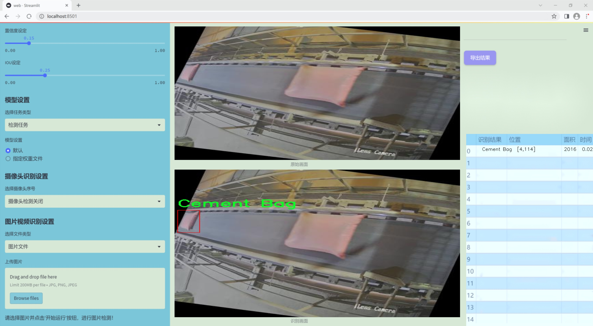
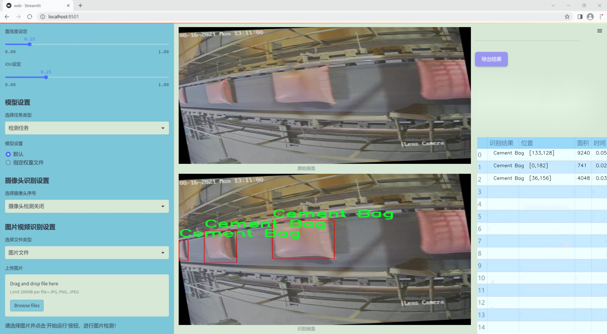
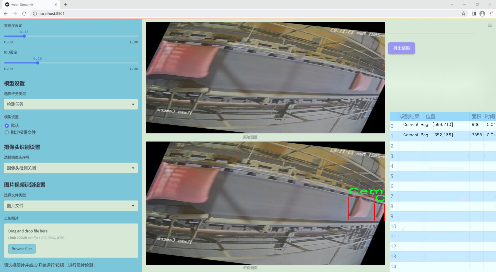
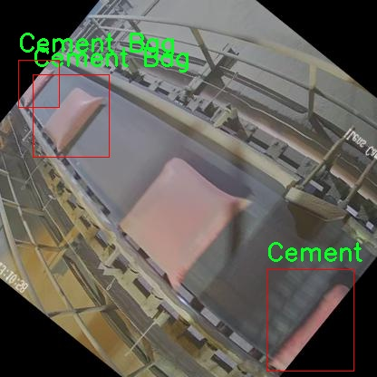
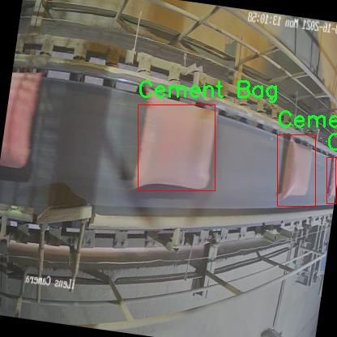
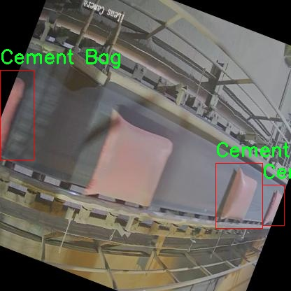
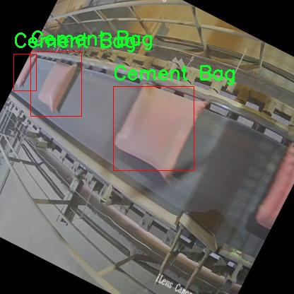
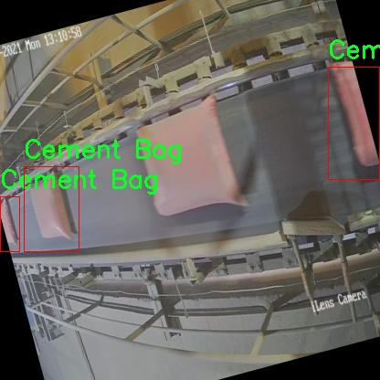

# 改进yolo11-LAWDS等200+全套创新点大全：流水线包装袋检测系统源码＆数据集全套

### 1.图片效果展示







##### 项目来源 **[人工智能促进会 2024.11.03](https://kdocs.cn/l/cszuIiCKVNis)**

注意：由于项目一直在更新迭代，上面“1.图片效果展示”和“2.视频效果展示”展示的系统图片或者视频可能为老版本，新版本在老版本的基础上升级如下：（实际效果以升级的新版本为准）

  （1）适配了YOLOV11的“目标检测”模型和“实例分割”模型，通过加载相应的权重（.pt）文件即可自适应加载模型。

  （2）支持“图片识别”、“视频识别”、“摄像头实时识别”三种识别模式。

  （3）支持“图片识别”、“视频识别”、“摄像头实时识别”三种识别结果保存导出，解决手动导出（容易卡顿出现爆内存）存在的问题，识别完自动保存结果并导出到tempDir中。

  （4）支持Web前端系统中的标题、背景图等自定义修改。

  另外本项目提供训练的数据集和训练教程,暂不提供权重文件（best.pt）,需要您按照教程进行训练后实现图片演示和Web前端界面演示的效果。

### 2.视频效果展示

[2.1 视频效果展示](https://www.bilibili.com/video/BV1kzDEYdEWk/)

### 3.背景

研究背景与意义

随着工业自动化的不断发展，产品包装的检测与质量控制已成为现代制造业中不可或缺的一部分。尤其是在水泥等大宗商品的包装领域，确保包装袋的完整性和质量直接关系到产品的市场竞争力和企业的经济效益。传统的人工检测方法不仅效率低下，而且容易受到人为因素的影响，导致检测结果的不稳定性。因此，开发一种高效、准确的自动化检测系统显得尤为重要。

近年来，深度学习技术的迅猛发展为物体检测任务提供了新的解决方案。YOLO（You Only Look Once）系列模型因其实时性和高准确率，已成为目标检测领域的主流方法。特别是YOLOv11的提出，进一步提升了检测精度和速度，使其在复杂环境下的应用成为可能。然而，针对特定行业的应用需求，现有的YOLOv11模型仍需进行改进，以适应流水线包装袋的检测任务。

本研究旨在基于改进的YOLOv11模型，构建一个高效的流水线包装袋检测系统。我们将使用包含6700张水泥袋图像的数据集进行训练和测试，确保模型能够在不同的光照、角度和背景下，准确识别和定位水泥袋。通过对模型的优化，我们期望能够显著提高检测的准确率和实时性，从而实现流水线的智能化监控，降低人工成本，提高生产效率。

本项目的研究不仅具有重要的理论意义，推动了深度学习在工业应用中的发展，同时也具有广泛的实际应用价值，为相关企业提供了一种高效的质量控制解决方案，助力其在激烈的市场竞争中立于不败之地。

### 4.数据集信息展示

##### 4.1 本项目数据集详细数据（类别数＆类别名）

nc: 1
names: ['Cement Bag']


该项目为【目标检测】数据集，请在【训练教程和Web端加载模型教程（第三步）】这一步的时候按照【目标检测】部分的教程来训练

##### 4.2 本项目数据集信息介绍

本项目数据集信息介绍

本项目所使用的数据集名为“tete”，专门用于训练和改进YOLOv11的流水线包装袋检测系统。该数据集的设计旨在提供高质量的样本，以支持在复杂的工业环境中实现高效的自动化检测。数据集中包含的类别数量为1，具体类别为“Cement Bag”，即水泥袋。这一单一类别的选择反映了项目的专注性，旨在通过深度学习技术提升水泥袋的检测精度和效率。

“tete”数据集的构建过程中，特别注重样本的多样性和代表性，以确保模型在实际应用中的鲁棒性。数据集中的图像涵盖了不同角度、光照条件和背景环境下的水泥袋样本，旨在模拟真实生产线上的各种情况。这种多样性不仅增强了模型的泛化能力，还为后续的模型训练提供了丰富的特征信息，使得YOLOv11能够更准确地识别和定位水泥袋。

此外，数据集的标注过程严格遵循标准化流程，确保每个样本的标注信息准确无误。这一过程不仅提高了数据集的质量，也为模型的训练提供了可靠的基础。通过使用“tete”数据集，研究团队希望能够显著提升YOLOv11在流水线包装袋检测任务中的表现，从而推动工业自动化技术的发展。

总之，“tete”数据集为本项目提供了坚实的数据基础，助力于实现高效、精准的水泥袋检测系统，为未来的研究和应用奠定了良好的基础。











### 5.全套项目环境部署视频教程（零基础手把手教学）

[5.1 所需软件PyCharm和Anaconda安装教程（第一步）](https://www.bilibili.com/video/BV1BoC1YCEKi/?spm_id_from=333.999.0.0&vd_source=bc9aec86d164b67a7004b996143742dc)


[5.2 安装Python虚拟环境创建和依赖库安装视频教程（第二步）](https://www.bilibili.com/video/BV1ZoC1YCEBw?spm_id_from=333.788.videopod.sections&vd_source=bc9aec86d164b67a7004b996143742dc)

### 6.改进YOLOv11训练教程和Web_UI前端加载模型教程（零基础手把手教学）

[6.1 改进YOLOv11训练教程和Web_UI前端加载模型教程（第三步）](https://www.bilibili.com/video/BV1BoC1YCEhR?spm_id_from=333.788.videopod.sections&vd_source=bc9aec86d164b67a7004b996143742dc)


按照上面的训练视频教程链接加载项目提供的数据集，运行train.py即可开始训练



     Epoch   gpu_mem       box       obj       cls    labels  img_size
     1/200     20.8G   0.01576   0.01955  0.007536        22      1280: 100%|██████████| 849/849 [14:42<00:00,  1.04s/it]
               Class     Images     Labels          P          R     mAP@.5 mAP@.5:.95: 100%|██████████| 213/213 [01:14<00:00,  2.87it/s]
                 all       3395      17314      0.994      0.957      0.0957      0.0843

     Epoch   gpu_mem       box       obj       cls    labels  img_size
     2/200     20.8G   0.01578   0.01923  0.007006        22      1280: 100%|██████████| 849/849 [14:44<00:00,  1.04s/it]
               Class     Images     Labels          P          R     mAP@.5 mAP@.5:.95: 100%|██████████| 213/213 [01:12<00:00,  2.95it/s]
                 all       3395      17314      0.996      0.956      0.0957      0.0845

     Epoch   gpu_mem       box       obj       cls    labels  img_size
     3/200     20.8G   0.01561    0.0191  0.006895        27      1280: 100%|██████████| 849/849 [10:56<00:00,  1.29it/s]
               Class     Images     Labels          P          R     mAP@.5 mAP@.5:.95: 100%|███████   | 187/213 [00:52<00:00,  4.04it/s]
                 all       3395      17314      0.996      0.957      0.0957      0.0845


###### [项目数据集下载链接](https://kdocs.cn/l/cszuIiCKVNis)

### 7.原始YOLOv11算法讲解


##### YOLOv11三大损失函数

YOLOv11（You Only Look Once）是一种流行的目标检测算法，其损失函数设计用于同时优化分类和定位任务。YOLO的损失函数通常包括几个部分：
**分类损失、定位损失（边界框回归损失）和置信度损失** 。其中，

  1. box_loss（边界框回归损失）是用于优化预测边界框与真实边界框之间的差异的部分。

  2. cls_loss（分类损失）是用于优化模型对目标类别的预测准确性的部分。分类损失确保模型能够正确地识别出图像中的对象属于哪个类别。

  3. dfl_loss（Distribution Focal Loss）是YOLO系列中的一种损失函数，特别是在一些改进版本如YOLOv5和YOLOv7中被引入。它的主要目的是解决目标检测中的类别不平衡问题，并提高模型在处理小目标和困难样本时的性能。

##### 边界框回归损失详解

box_loss（边界框回归损失）是用于优化预测边界框与真实边界框之间的差异的部分。


##### box_loss 的具体意义


##### 为什么需要 box_loss

  * 精确定位：通过最小化中心点坐标损失和宽高损失，模型能够更准确地预测目标的位置和大小。
  * 平衡不同类型的目标：使用平方根来处理宽高损失，可以更好地平衡不同大小的目标，确保小目标也能得到足够的关注。
  * 稳定训练：适当的损失函数设计有助于模型的稳定训练，避免梯度爆炸或消失等问题。

##### 分类损失详解

在YOLO（You Only Look
Once）目标检测算法中，cls_loss（分类损失）是用于优化模型对目标类别的预测准确性的部分。分类损失确保模型能够正确地识别出图像中的对象属于哪个类别。下面是关于cls_loss的详细解读：

##### 分类损失 (cls_loss) 的具体意义

  
分类损失通常使用交叉熵损失（Cross-Entropy
Loss）来计算。交叉熵损失衡量的是模型预测的概率分布与真实标签之间的差异。在YOLO中，分类损失的具体形式如下：


##### 为什么需要 cls_loss

  * 类别识别：cls_loss 确保模型能够正确识别出图像中的目标属于哪个类别。这对于目标检测任务至关重要，因为不仅需要知道目标的位置，还需要知道目标的类型。

  * 多类别支持：通过最小化分类损失，模型可以处理多个类别的目标检测任务。例如，在道路缺陷检测中，可能需要识别裂缝、坑洞、路面破损等多种类型的缺陷。

  * 提高准确性：分类损失有助于提高模型的分类准确性，从而提升整体检测性能。通过优化分类损失，模型可以更好地学习不同类别之间的特征差异。

##### 分布损失详解

`dfl_loss`（Distribution Focal
Loss）是YOLO系列中的一种损失函数，特别是在一些改进版本如YOLOv5和YOLOv7中被引入。它的主要目的是解决目标检测中的类别不平衡问题，并提高模型在处理小目标和困难样本时的性能。下面是对`dfl_loss`的详细解读：

##### DFL Loss 的背景

在目标检测任务中，类别不平衡是一个常见的问题。某些类别的样本数量可能远远多于其他类别，这会导致模型在训练过程中对常见类别的学习效果较好，而对罕见类别的学习效果较差。此外，小目标和困难样本的检测也是一个挑战，因为这些目标通常具有较少的特征信息，容易被忽略或误分类。

为了应对这些问题，研究者们提出了多种改进方法，其中之一就是`dfl_loss`。`dfl_loss`通过引入分布焦点损失来增强模型对困难样本的关注，并改善类别不平衡问题。

##### DFL Loss 的定义

DFL Loss
通常与传统的交叉熵损失结合使用，以增强模型对困难样本的学习能力。其核心思想是通过对每个类别的预测概率进行加权，使得模型更加关注那些难以正确分类的样本。

DFL Loss 的公式可以表示为：


##### DFL Loss 的具体意义**

  * **类别不平衡：** 通过引入平衡因子 α，DFL Loss 可以更好地处理类别不平衡问题。对于少数类别的样本，可以通过增加其权重来提升其重要性，从而提高模型对这些类别的检测性能。
  *  **困难样本：** 通过聚焦参数 γ，DFL Loss 可以让模型更加关注那些难以正确分类的样本。当 
  * γ 较大时，模型会对那些预测概率较低的样本给予更多的关注，从而提高这些样本的分类准确性。
  *  **提高整体性能** ：DFL Loss 结合了传统交叉熵损失的优势，并通过加权机制增强了模型对困难样本的学习能力，从而提高了整体的检测性能。


### 8.200+种全套改进YOLOV11创新点原理讲解

#### 8.1 200+种全套改进YOLOV11创新点原理讲解大全

由于篇幅限制，每个创新点的具体原理讲解就不全部展开，具体见下列网址中的改进模块对应项目的技术原理博客网址【Blog】（创新点均为模块化搭建，原理适配YOLOv5~YOLOv11等各种版本）

[改进模块技术原理博客【Blog】网址链接](https://gitee.com/qunmasj/good)


#### 8.2 精选部分改进YOLOV11创新点原理讲解

###### 这里节选部分改进创新点展开原理讲解(完整的改进原理见上图和[改进模块技术原理博客链接](https://gitee.com/qunmasj/good)【如果此小节的图加载失败可以通过CSDN或者Github搜索该博客的标题访问原始博客，原始博客图片显示正常】


### D-LKA Attention简介
自2010年代中期以来，卷积神经网络（CNNs）已成为许多计算机视觉应用的首选技术。它们能够从原始数据中自动提取复杂的特征表示，无需手动进行特征工程，这引起了医学图像分析社区的极大兴趣。许多成功的CNN架构，如U-Net、全卷积网络、DeepLab或SegCaps（分割胶囊），已经被开发出来。这些架构在语义分割任务中取得了巨大成功，先前的最新方法已经被超越。

在计算机视觉研究中，不同尺度下的目标识别是一个关键问题。在CNN中，可检测目标的大小与相应网络层的感受野尺寸密切相关。如果一个目标扩展到超出这个感受野的边界，这可能会导致欠分割结果。相反，与目标实际大小相比使用过大的感受野可能会限制识别，因为背景信息可能会对预测产生不必要的影响。

解决这个问题的一个有希望的方法涉及在并行使用具有不同尺寸的多个Kernel，类似于Inception块的机制。然而，由于参数和计算要求的指数增长，将Kernel大小增加以容纳更大的目标在实践中受到限制。因此，出现了各种策略，包括金字塔池化技术和不同尺度的扩张卷积，以捕获多尺度的上下文信息。

另一个直观的概念涉及将多尺度图像金字塔或它们的相关特征表示直接纳入网络架构。然而，这种方法存在挑战，特别是在管理训练和推理时间方面的可行性方面存在挑战。在这个背景下，使用编码器-解码器网络，如U-Net，已被证明是有利的。这样的网络在较浅的层中编码外观和位置，而在更深的层中，通过神经元的更广泛的感受野捕获更高的语义信息和上下文信息。

一些方法将来自不同层的特征组合在一起，或者预测来自不同尺寸的层的特征以使用多尺度的信息。此外，出现了从不同尺度的层中预测特征的方法，有效地实现了跨多个尺度的见解整合。然而，大多数编码器-解码器结构面临一个挑战：它们经常无法在不同尺度之间保持一致的特征，并主要使用最后一个解码器层生成分割结果。

语义分割是一项任务，涉及根据预定义的标签集为图像中的每个像素预测语义类别。这项任务要求提取高级特征同时保留初始的空间分辨率。CNNs非常适合捕获局部细节和低级信息，尽管以忽略全局上下文为代价。视觉Transformer（ViT）架构已经成为解决处理全局信息的视觉任务的关键，包括语义分割，取得了显著的成功。

ViT的基础是注意力机制，它有助于在整个输入序列上聚合信息。这种能力使网络能够合并远程的上下文提示，超越了CNN的有限感受野尺寸。然而，这种策略通常会限制ViT有效建模局部信息的能力。这种局限可能会妨碍它们检测局部纹理的能力，这对于各种诊断和预测任务至关重要。这种缺乏局部表示可以归因于ViT模型处理图像的特定方式。

ViT模型将图像分成一系列Patch，并使用自注意力机制来模拟它们之间的依赖关系。这种方法可能不如CNN模型中的卷积操作对感受野内提取局部特征有效。ViT和CNN模型之间的这种图像处理方法的差异可能解释了CNN模型在局部特征提取方面表现出色的原因。

近年来，已经开发出创新性方法来解决Transformer模型内部局部纹理不足的问题。其中一种方法是通过互补方法将CNN和ViT特征结合起来，以结合它们的优势并减轻局部表示的不足。TransUNet是这种方法的早期示例，它在CNN的瓶颈中集成了Transformer层，以模拟局部和全局依赖关系。HiFormer提出了一种解决方案，将Swin Transformer模块和基于CNN的编码器结合起来，生成两个多尺度特征表示，通过Double-Level Fusion模块集成。UNETR使用基于Transformer的编码器和CNN解码器进行3D医学图像分割。CoTr和TransBTS通过Transformer在低分辨率阶段增强分割性能，将CNN编码器和解码器连接在一起。

增强局部特征表示的另一种策略是重新设计纯Transformer模型内部的自注意力机制。在这方面，Swin-Unet在U形结构中集成了一个具有线性计算复杂性的Swin Transformer块作为多尺度 Backbone 。MISSFormer采用高效Transformer来解决视觉Transformer中的参数问题，通过在输入块上进行不可逆的降采样操作。D-Former引入了一个纯Transformer的管道，具有双重注意模块，以分段的方式捕获细粒度的局部注意和与多元单元的交互。然而，仍然存在一些特定的限制，包括计算效率低下，如TransUNet模型所示，对CNN Backbone 的严重依赖，如HiFormer所观察到的，以及对多尺度信息的忽略。

此外，目前的分割架构通常采用逐层处理3D输入 volumetric 的方法，无意中忽视了相邻切片之间的潜在相关性。这一疏忽限制了对 volumetric 信息的全面利用，因此损害了定位精度和上下文集成。此外，必须认识到，医学领域的病变通常在形状上发生变形。因此，用于医学图像分析的任何学习算法都必须具备捕捉和理解这些变形的能力。与此同时，该算法应保持计算效率，以便处理3D volumetric数据。

为了解决上述提到的挑战，作者提出了一个解决方案，即可变形大卷积核注意力模块（Deformable LKA module），它是作者网络设计的基本构建模块。这个模块明确设计成在有效处理上下文信息的同时保留局部描述符。作者的架构在这两个方面的平衡增强了实现精确语义分割的能力。

值得注意的是，参考该博客引入了一种基于数据的感受野的动态适应，不同于传统卷积操作中的固定滤波器Mask。这种自适应方法使作者能够克服与静态方法相关的固有限制。这种创新方法还扩展到了D-LKA Net架构的2D和3D版本的开发。

在3D模型的情况下，D-LKA机制被量身定制以适应3D环境，从而实现在不同 volumetric 切片之间无缝信息交互。最后，作者的贡献通过其计算效率得到进一步强调。作者通过仅依靠D-LKA概念的设计来实现这一点，在各种分割基准上取得了显著的性能，确立了作者的方法作为一种新的SOTA方法。

在本节中，作者首先概述方法论。首先，作者回顾了由Guo等人引入的大卷积核注意力（Large Kernel Attention，LKA）的概念。然后，作者介绍了作者对可变形LKA模块的创新探索。在此基础上，作者介绍了用于分割任务的2D和3D网络架构。

大卷积核提供了与自注意力机制类似的感受野。可以通过使用深度卷积、深度可扩展卷积和卷积来构建大卷积核，从而减少了参数和计算量。构建输入维度为和通道数的卷积核的深度卷积和深度可扩展卷积的卷积核大小的方程如下：


具有卷积核大小和膨胀率。参数数量和浮点运算（FLOPs）的计算如下：


FLOPs的数量与输入图像的大小成线性增长。参数的数量随通道数和卷积核大小的增加而呈二次增长。然而，由于它们通常都很小，因此它们不是限制因素。

为了最小化对于固定卷积核大小K的参数数量，可以将方程3对于膨胀率的导数设定为零：


例如，当卷积核大小为时，结果是。将这些公式扩展到3D情况是直接的。对于大小为和通道数C的输入，3D情况下参数数量和FLOPs 的方程如下：


具有卷积核大小和膨胀。


利用大卷积核进行医学图像分割的概念通过引入可变形卷积得以扩展。可变形卷积可以通过整数偏移自由调整采样网格以进行自由变形。额外的卷积层从特征图中学习出变形，从而创建一个偏移场。基于特征本身学习变形会导致自适应卷积核。这种灵活的卷积核形状可以提高病变或器官变形的表示，从而增强了目标边界的定义。

负责计算偏移的卷积层遵循其相应卷积层的卷积核大小和膨胀。双线性插值用于计算不在图像网格上的偏移的像素值。如图2所示，D-LKA模块可以表示为：


其中输入特征由表示，。表示为注意力图，其中每个值表示相应特征的相对重要性。运算符  表示逐元素乘法运算。值得注意的是，LKA不同于传统的注意力方法，它不需要额外的规范化函数，如或。这些规范化函数往往忽视高频信息，从而降低了基于自注意力的方法的性能。

在该方法的2D版本中，卷积层被可变形卷积所替代，因为可变形卷积能够改善对具有不规则形状和大小的目标的捕捉能力。这些目标在医学图像数据中常常出现，因此这种增强尤为重要。

然而，将可变形LKA的概念扩展到3D领域会带来一定的挑战。主要的约束来自于需要用于生成偏移的额外卷积层。与2D情况不同，由于输入和输出通道的性质，这一层无法以深度可分的方式执行。在3D环境中，输入通道对应于特征，而输出通道扩展到，其中是卷积核的大小。大卷积核的复杂性导致沿第3D的通道数扩展，导致参数和FLOPs大幅增加。因此，针对3D情况采用了另一种替代方法。在现有的LKA框架中，深度卷积之后引入了一个单独的可变形卷积层。这种战略性的设计调整旨在减轻扩展到3D领域所带来的挑战。


2D网络的架构如图1所示。第一变种使用MaxViT作为编码器组件，用于高效特征提取，而第二变种则结合可变形LKA层进行更精细、卓越的分割。

在更正式的描述中，编码器生成4个分层输出表示。首先，卷积干扰将输入图像的维度减小到。随后，通过4个MaxViT块的4个阶段进行特征提取，每个阶段后跟随降采样层。随着过程进展到解码器，实施了4个阶段的D-LKA层，每个阶段包含2个D-LKA块。然后，应用Patch扩展层以实现分辨率上采样，同时减小通道维度。最后，线性层负责生成最终的输出。

2D D-LKA块的结构包括LayerNorm、可变形LKA和多层感知器（MLP）。积分残差连接确保了有效的特征传播，即使在更深层也是如此。这个安排可以用数学方式表示为：


其中输入特征，层归一化LN，可变形LKA注意力，深度卷积，线性层和GeLU激活函数。

3D网络架构如图1所示，采用编码器-解码器设计进行分层结构化。首先，一个Patch嵌入层将输入图像的维度从（）减小到（）。在编码器中，采用了3个D-LKA阶段的序列，每个阶段包含3个D-LKA块。在每个阶段之后，通过降采样步骤将空间分辨率减半，同时将通道维度加倍。中央瓶颈包括另一组2个D-LKA块。解码器结构与编码器相对称。

为了将特征分辨率加倍，同时减少通道数，使用转置卷积。每个解码器阶段都使用3个D-LKA块来促进远距离特征依赖性。最终的分割输出由一个卷积层产生，后面跟随一个卷积层以匹配特定类别的通道要求。

为了建立输入图像和分割输出之间的直接连接，使用卷积形成了一个跳跃连接。额外的跳跃连接根据简单的加法对来自其他阶段的特征进行融合。最终的分割图是通过和卷积层的组合产生的。

3D D-LKA块包括层归一化，后跟D-LKA注意力，应用了残差连接的部分。随后的部分采用了一个卷积层，后面跟随一个卷积层，两者都伴随着残差连接。这个整个过程可以总结如下：


带有输入特征 、层归一化 、可变形 LKA 、卷积层 和输出特征 的公式。是指一个前馈网络，包括2个卷积层和激活函数。

表7显示了普通卷积和构建卷积的参数数量比较。尽管标准卷积的参数数量在通道数较多时急剧增加，但分解卷积的参数总体较低，并且增长速度不那么快。

与分解卷积相比，可变形分解卷积增加了大量参数，但仍然明显小于标准卷积。可变形卷积的主要参数是由偏移网络创建的。在这里，作者假设可变形深度卷积的Kernel大小为（5,5），可变形深度空洞卷积的Kernel大小为（7,7）。这导致了21×21大小的大Kernel的最佳参数数量。更高效地生成偏移量的方法将大大减少参数数量。


值得注意的是，引入可变形LKA确实会增加模型的参数数量和每秒的浮点运算次数（FLOPS）。然而，重要的是强调，这增加的计算负载不会影响作者模型的整体推理速度。

相反，对于Batch-size > 1，作者甚至观察到推理时间的减少，如图7所示。例如，基于作者的广泛实验，作者观察到对于Batch-size为16，具有可变形卷积和没有可变形卷积的推理时间分别为8.01毫秒和17.38毫秒。作者认为这是由于在2D中对可变形卷积的高效实现所致。为了测量时间，使用了大小为（）的随机输入。在GPU热身周期50次迭代之后，网络被推断了1000次。测量是在NVIDIA RTX 3090 GPU上进行的。


为了充分利用性能与参数之间的权衡关系，作者在图8中可视化了在Synapse 2D数据集上报告的DSC和HD性能以及基于参数数量的内存消耗。D-LKA Net引入了相当多的参数，约为101M。这比性能第二好的方法ScaleFormer使用的111.6M参数要少。

与更轻量级的DAEFormer模型相比，作者实现了更好的性能，这证明了参数增加的合理性。大多数参数来自于MaxViT编码器；因此，将编码器替换为更高效的编码器可以减少模型参数。值得注意的是，在此可视化中，作者最初将HD和内存值都归一化到[0, 100]范围内。随后，作者将它们从100缩小，以增强更高值的表示。


### 9.系统功能展示

图9.1.系统支持检测结果表格显示

  图9.2.系统支持置信度和IOU阈值手动调节

  图9.3.系统支持自定义加载权重文件best.pt(需要你通过步骤5中训练获得)

  图9.4.系统支持摄像头实时识别

  图9.5.系统支持图片识别

  图9.6.系统支持视频识别

  图9.7.系统支持识别结果文件自动保存

  图9.8.系统支持Excel导出检测结果数据


### 10. YOLOv11核心改进源码讲解

#### 10.1 pkinet.py

以下是对给定代码的核心部分进行提炼和详细注释的结果：

```python
import math
import torch
import torch.nn as nn

# 定义 DropPath 函数，用于随机丢弃路径（随机深度）
def drop_path(x: torch.Tensor, drop_prob: float = 0., training: bool = False) -> torch.Tensor:
    """在残差块的主路径中随机丢弃路径（随机深度）。
    
    Args:
        x (torch.Tensor): 输入张量。
        drop_prob (float): 丢弃概率，默认为 0。
        training (bool): 是否处于训练模式，默认为 False。
    
    Returns:
        torch.Tensor: 处理后的张量。
    """
    if drop_prob == 0. or not training:
        return x  # 如果丢弃概率为 0 或不在训练模式下，返回原始输入
    keep_prob = 1 - drop_prob
    shape = (x.shape[0], ) + (1, ) * (x.ndim - 1)  # 处理不同维度的张量
    random_tensor = keep_prob + torch.rand(shape, dtype=x.dtype, device=x.device)
    output = x.div(keep_prob) * random_tensor.floor()  # 应用丢弃
    return output

# 定义 DropPath 类，继承自 nn.Module
class DropPath(nn.Module):
    """随机深度模块，按样本丢弃路径。"""
    def __init__(self, drop_prob: float = 0.1):
        super().__init__()
        self.drop_prob = drop_prob  # 丢弃概率

    def forward(self, x: torch.Tensor) -> torch.Tensor:
        return drop_path(x, self.drop_prob, self.training)  # 前向传播

# 定义 ConvFFN 类，表示多层感知机
class ConvFFN(nn.Module):
    """使用 ConvModule 实现的多层感知机。"""
    def __init__(self, in_channels: int, out_channels: Optional[int] = None, hidden_channels_scale: float = 4.0):
        super().__init__()
        out_channels = out_channels or in_channels
        hidden_channels = int(in_channels * hidden_channels_scale)

        # 定义前向传播的层
        self.ffn_layers = nn.Sequential(
            nn.LayerNorm(in_channels),  # 归一化
            nn.Conv2d(in_channels, hidden_channels, kernel_size=1),  # 1x1 卷积
            nn.Conv2d(hidden_channels, hidden_channels, kernel_size=3, padding=1, groups=hidden_channels),  # 深度卷积
            nn.GELU(),  # 激活函数
            nn.Dropout(0.1),  # Dropout
            nn.Conv2d(hidden_channels, out_channels, kernel_size=1),  # 1x1 卷积
            nn.Dropout(0.1),  # Dropout
        )

    def forward(self, x):
        return self.ffn_layers(x)  # 前向传播

# 定义 PKIBlock 类，表示多核 Inception 模块
class PKIBlock(nn.Module):
    """多核 Inception 块。"""
    def __init__(self, in_channels: int, out_channels: Optional[int] = None):
        super().__init__()
        out_channels = out_channels or in_channels
        self.block = ConvFFN(in_channels, out_channels)  # 使用 ConvFFN 作为块

    def forward(self, x):
        return self.block(x)  # 前向传播

# 定义 PKINet 类，表示多核 Inception 网络
class PKINet(nn.Module):
    """多核 Inception 网络。"""
    def __init__(self, arch: str = 'S'):
        super().__init__()
        self.stages = nn.ModuleList()  # 定义网络的各个阶段
        self.stages.append(PKIBlock(3, 32))  # 添加初始块
        # 这里可以根据不同的架构添加更多的 PKIBlock

    def forward(self, x):
        for stage in self.stages:
            x = stage(x)  # 逐层前向传播
        return x

# 创建不同架构的模型
def PKINET_T():
    return PKINet('T')

def PKINET_S():
    return PKINet('S')

def PKINET_B():
    return PKINet('B')

if __name__ == '__main__':
    model = PKINET_T()  # 实例化模型
    inputs = torch.randn((1, 3, 640, 640))  # 创建输入张量
    res = model(inputs)  # 前向传播
    print(res.size())  # 输出结果的尺寸
```

### 代码注释说明
1. **DropPath**: 这个类实现了随机深度的功能，可以在训练过程中随机丢弃某些路径，以增强模型的泛化能力。
2. **ConvFFN**: 这个类实现了一个多层感知机，使用卷积层代替全连接层，适合处理图像数据。
3. **PKIBlock**: 这个类是多核 Inception 模块的实现，利用 ConvFFN 进行特征提取。
4. **PKINet**: 这个类是整个网络的实现，包含多个阶段（块），可以根据需要扩展。

### 总结
上述代码实现了一个基于多核 Inception 的深度学习模型，核心功能包括随机深度、卷积前馈网络和模块化设计。通过合理的注释，便于理解每个模块的功能和作用。

这个文件 `pkinet.py` 实现了一个名为 PKINet 的深度学习模型，主要用于计算机视觉任务。该模型基于多种模块构建，包括卷积层、注意力机制、全连接层等。文件中使用了 PyTorch 框架，并且提供了多个可配置的参数，以便于用户根据需求调整模型结构。

首先，文件导入了一些必要的库和模块，包括数学库、PyTorch 相关的模块，以及一些可能的外部库（如 mmcv 和 mmengine）。这些库提供了构建神经网络所需的基础功能。

接下来，定义了一些辅助函数和类。`drop_path` 函数实现了随机深度（Stochastic Depth）技术，用于在训练过程中随机丢弃某些路径，以增强模型的泛化能力。`DropPath` 类是对该函数的封装，作为一个可训练的模块使用。

`autopad` 函数用于自动计算卷积层的填充，以确保输出的尺寸符合预期。`make_divisible` 函数则用于确保通道数能够被指定的除数整除，这在某些模型架构中是一个重要的要求。

接下来，定义了一些基本的模块类，如 `BCHW2BHWC` 和 `BHWC2BCHW`，用于在不同的张量维度之间进行转换。`GSiLU` 类实现了一种激活函数，结合了全局平均池化和 Sigmoid 函数。`CAA` 类实现了上下文锚点注意力机制，用于增强特征表示。

`ConvFFN` 类实现了一个多层感知机（MLP），使用卷积模块构建，支持添加身份连接。`Stem` 类是模型的初始层，负责将输入特征图转换为适合后续处理的特征图。`DownSamplingLayer` 类用于下采样操作。

`InceptionBottleneck` 类实现了一个瓶颈结构，结合了多个卷积层和注意力机制。`PKIBlock` 类则是多核的 Inception 模块，包含了多个卷积层和全连接层，支持身份连接和可选的层缩放。

`PKIStage` 类是模型的一个阶段，包含多个 `PKIBlock`，并且在阶段之间进行下采样。最后，`PKINet` 类是整个模型的主体，负责将各个阶段组合在一起，并实现前向传播。

在 `PKINet` 的构造函数中，定义了不同的架构设置，包括不同的通道数、卷积核大小、扩展比例等。模型的初始化权重也在此处进行配置。`forward` 方法实现了模型的前向传播逻辑，返回指定的输出。

文件的最后部分定义了三个函数 `PKINET_T`、`PKINET_S` 和 `PKINET_B`，分别返回不同配置的 PKINet 模型。主程序部分则创建了一个 PKINET_T 模型实例，并对随机输入进行前向传播，输出各层的特征图尺寸。

整体来看，这个文件实现了一个灵活且强大的深度学习模型，适用于各种计算机视觉任务，并且通过模块化设计使得模型的构建和修改变得更加方便。

#### 10.2 hcfnet.py

以下是代码中最核心的部分，并对其进行了详细的中文注释：

```python
import torch
import torch.nn as nn
import torch.nn.functional as F

class SpatialAttentionModule(nn.Module):
    def __init__(self):
        super(SpatialAttentionModule, self).__init__()
        # 定义一个2D卷积层，用于生成空间注意力图
        self.conv2d = nn.Conv2d(in_channels=2, out_channels=1, kernel_size=7, stride=1, padding=3)
        self.sigmoid = nn.Sigmoid()  # 使用Sigmoid激活函数

    def forward(self, x):
        # 计算输入特征图的平均值和最大值
        avgout = torch.mean(x, dim=1, keepdim=True)  # 沿通道维度计算平均值
        maxout, _ = torch.max(x, dim=1, keepdim=True)  # 沿通道维度计算最大值
        # 将平均值和最大值拼接在一起
        out = torch.cat([avgout, maxout], dim=1)
        # 通过卷积层和Sigmoid激活函数生成注意力图
        out = self.sigmoid(self.conv2d(out))
        # 将注意力图应用到输入特征图上
        return out * x

class LocalGlobalAttention(nn.Module):
    def __init__(self, output_dim, patch_size):
        super().__init__()
        self.output_dim = output_dim
        self.patch_size = patch_size
        # 定义两个全连接层，用于处理局部特征
        self.mlp1 = nn.Linear(patch_size * patch_size, output_dim // 2)
        self.norm = nn.LayerNorm(output_dim // 2)  # 层归一化
        self.mlp2 = nn.Linear(output_dim // 2, output_dim)
        self.conv = nn.Conv2d(output_dim, output_dim, kernel_size=1)  # 1x1卷积
        # 定义可学习的参数
        self.prompt = torch.nn.parameter.Parameter(torch.randn(output_dim, requires_grad=True)) 
        self.top_down_transform = torch.nn.parameter.Parameter(torch.eye(output_dim), requires_grad=True)

    def forward(self, x):
        # 将输入特征图的维度调整为(B, H, W, C)
        x = x.permute(0, 2, 3, 1)
        B, H, W, C = x.shape
        P = self.patch_size

        # 局部特征提取
        local_patches = x.unfold(1, P, P).unfold(2, P, P)  # 提取局部patch
        local_patches = local_patches.reshape(B, -1, P * P, C)  # 重塑形状
        local_patches = local_patches.mean(dim=-1)  # 计算每个patch的平均值

        # 通过MLP处理局部特征
        local_patches = self.mlp1(local_patches)  # (B, H/P*W/P, input_dim // 2)
        local_patches = self.norm(local_patches)  # 归一化
        local_patches = self.mlp2(local_patches)  # (B, H/P*W/P, output_dim)

        # 计算局部注意力
        local_attention = F.softmax(local_patches, dim=-1)  # 计算softmax
        local_out = local_patches * local_attention  # 应用注意力

        # 计算余弦相似度并生成mask
        cos_sim = F.normalize(local_out, dim=-1) @ F.normalize(self.prompt[None, ..., None], dim=1)  # 计算余弦相似度
        mask = cos_sim.clamp(0, 1)  # 限制mask的范围在[0, 1]
        local_out = local_out * mask  # 应用mask
        local_out = local_out @ self.top_down_transform  # 进行变换

        # 恢复形状并上采样
        local_out = local_out.reshape(B, H // P, W // P, self.output_dim)  # (B, H/P, W/P, output_dim)
        local_out = local_out.permute(0, 3, 1, 2)  # 调整维度
        local_out = F.interpolate(local_out, size=(H, W), mode='bilinear', align_corners=False)  # 上采样
        output = self.conv(local_out)  # 通过卷积层

        return output

class PPA(nn.Module):
    def __init__(self, in_features, filters) -> None:
        super().__init__()
        # 定义多个卷积层和注意力模块
        self.skip = nn.Conv2d(in_features, filters, kernel_size=1, stride=1)  # 跳跃连接
        self.c1 = nn.Conv2d(filters, filters, kernel_size=3, padding=1)
        self.c2 = nn.Conv2d(filters, filters, kernel_size=3, padding=1)
        self.c3 = nn.Conv2d(filters, filters, kernel_size=3, padding=1)
        self.sa = SpatialAttentionModule()  # 空间注意力模块
        self.lga2 = LocalGlobalAttention(filters, 2)  # 局部全局注意力模块
        self.lga4 = LocalGlobalAttention(filters, 4)  # 局部全局注意力模块
        self.drop = nn.Dropout2d(0.1)  # Dropout层
        self.bn1 = nn.BatchNorm2d(filters)  # 批归一化
        self.silu = nn.SiLU()  # SiLU激活函数

    def forward(self, x):
        # 前向传播
        x_skip = self.skip(x)  # 跳跃连接
        x_lga2 = self.lga2(x_skip)  # 局部全局注意力
        x_lga4 = self.lga4(x_skip)  # 局部全局注意力
        x1 = self.c1(x)  # 第一个卷积
        x2 = self.c2(x1)  # 第二个卷积
        x3 = self.c3(x2)  # 第三个卷积
        # 将所有特征相加
        x = x1 + x2 + x3 + x_skip + x_lga2 + x_lga4
        x = self.bn1(x)  # 批归一化
        x = self.sa(x)  # 空间注意力
        x = self.drop(x)  # Dropout
        x = self.silu(x)  # SiLU激活
        return x
```

以上代码展示了一个深度学习模型的核心部分，包括空间注意力模块、局部全局注意力模块和PPA模块。每个模块的功能和前向传播过程都有详细的注释，便于理解其实现逻辑。

这个程序文件 `hcfnet.py` 定义了一些用于深度学习的模块，主要用于图像处理和特征提取。文件中包含多个类，每个类实现了特定的功能。

首先，`SpatialAttentionModule` 类实现了空间注意力机制。它通过对输入张量进行平均和最大池化操作，生成两个特征图，然后将这两个特征图拼接在一起，经过卷积和 Sigmoid 激活函数，最终得到一个注意力权重图。这个权重图会与输入张量相乘，从而强调重要的特征区域。

接下来，`LocalGlobalAttention` 类实现了局部和全局注意力机制。它首先将输入张量重新排列为局部补丁，然后通过多层感知机（MLP）对这些补丁进行处理，生成局部特征。通过计算余弦相似度和应用掩码，得到加权后的局部特征，最后通过插值和卷积操作恢复到原始尺寸，输出特征图。

`ECA` 类实现了有效通道注意力机制。它通过自适应平均池化和一维卷积来计算通道注意力，使用 Sigmoid 激活函数生成通道权重，并将其应用于输入张量，以增强重要通道的特征。

`PPA` 类是一个复合模块，结合了前面提到的空间注意力、有效通道注意力和局部全局注意力。它使用多个卷积层和跳跃连接来提取特征，并通过注意力机制来提升特征的表达能力。最终，经过批归一化和激活函数处理后，输出增强后的特征图。

`Bag` 类实现了一个简单的加权融合机制，接收三个输入，分别是特征图、输入图像和注意力图，通过计算加权和来生成最终的输出。

最后，`DASI` 类是一个更复杂的模块，整合了多个输入特征图。它通过跳跃连接和卷积操作来处理不同尺度的特征，并利用 `Bag` 类进行特征融合。最终，经过尾部卷积、跳跃连接和激活函数处理后，输出融合后的特征图。

整个文件展示了如何通过组合不同的注意力机制和卷积操作来构建一个强大的特征提取网络，适用于图像分类、目标检测等任务。

#### 10.3 mobilenetv4.py

以下是经过简化并添加详细中文注释的核心代码部分：

```python
import torch
import torch.nn as nn

# 定义模型规格
MODEL_SPECS = {
    "MobileNetV4ConvSmall": MNV4ConvSmall_BLOCK_SPECS,
    "MobileNetV4ConvMedium": MNV4ConvMedium_BLOCK_SPECS,
    "MobileNetV4ConvLarge": MNV4ConvLarge_BLOCK_SPECS,
    "MobileNetV4HybridMedium": MNV4HybridConvMedium_BLOCK_SPECS,
    "MobileNetV4HybridLarge": MNV4HybridConvLarge_BLOCK_SPECS,
}

def conv_2d(inp, oup, kernel_size=3, stride=1, groups=1, bias=False, norm=True, act=True):
    """
    创建一个2D卷积层，包含卷积、批归一化和激活函数（ReLU6）。
    
    Args:
        inp: 输入通道数
        oup: 输出通道数
        kernel_size: 卷积核大小
        stride: 步幅
        groups: 分组卷积
        bias: 是否使用偏置
        norm: 是否使用批归一化
        act: 是否使用激活函数
    
    Returns:
        nn.Sequential: 包含卷积层、批归一化和激活函数的序列
    """
    conv = nn.Sequential()
    padding = (kernel_size - 1) // 2  # 计算填充
    conv.add_module('conv', nn.Conv2d(inp, oup, kernel_size, stride, padding, bias=bias, groups=groups))
    if norm:
        conv.add_module('BatchNorm2d', nn.BatchNorm2d(oup))  # 添加批归一化
    if act:
        conv.add_module('Activation', nn.ReLU6())  # 添加激活函数
    return conv

class InvertedResidual(nn.Module):
    """
    反向残差块，包含扩展卷积、深度卷积和投影卷积。
    """
    def __init__(self, inp, oup, stride, expand_ratio, act=False):
        super(InvertedResidual, self).__init__()
        self.stride = stride
        assert stride in [1, 2]  # 步幅只能为1或2
        hidden_dim = int(round(inp * expand_ratio))  # 计算隐藏层维度
        self.block = nn.Sequential()
        
        # 如果扩展比不为1，添加扩展卷积
        if expand_ratio != 1:
            self.block.add_module('exp_1x1', conv_2d(inp, hidden_dim, kernel_size=1, stride=1))
        
        # 添加深度卷积
        self.block.add_module('conv_3x3', conv_2d(hidden_dim, hidden_dim, kernel_size=3, stride=stride, groups=hidden_dim))
        
        # 添加投影卷积
        self.block.add_module('red_1x1', conv_2d(hidden_dim, oup, kernel_size=1, stride=1, act=act))
        
        # 判断是否使用残差连接
        self.use_res_connect = self.stride == 1 and inp == oup

    def forward(self, x):
        # 如果使用残差连接，则返回输入与块的输出相加
        if self.use_res_connect:
            return x + self.block(x)
        else:
            return self.block(x)

class MobileNetV4(nn.Module):
    """
    MobileNetV4模型，支持多种不同规格的模型。
    """
    def __init__(self, model):
        super().__init__()
        assert model in MODEL_SPECS.keys()  # 确保模型名称有效
        self.model = model
        self.spec = MODEL_SPECS[self.model]
       
        # 构建模型的各个层
        self.conv0 = build_blocks(self.spec['conv0'])
        self.layer1 = build_blocks(self.spec['layer1'])
        self.layer2 = build_blocks(self.spec['layer2'])
        self.layer3 = build_blocks(self.spec['layer3'])
        self.layer4 = build_blocks(self.spec['layer4'])
        self.layer5 = build_blocks(self.spec['layer5'])
        
        # 将所有层放入ModuleList中
        self.features = nn.ModuleList([self.conv0, self.layer1, self.layer2, self.layer3, self.layer4, self.layer5])     

    def forward(self, x):
        """
        前向传播，返回特征图。
        """
        input_size = x.size(2)
        scale = [4, 8, 16, 32]  # 需要提取特征的尺度
        features = [None, None, None, None]
        
        # 依次通过每一层
        for f in self.features:
            x = f(x)
            if input_size // x.size(2) in scale:
                features[scale.index(input_size // x.size(2))] = x  # 保存特征图
        return features

# 定义不同规格的MobileNetV4模型构造函数
def MobileNetV4ConvSmall():
    return MobileNetV4('MobileNetV4ConvSmall')

def MobileNetV4ConvMedium():
    return MobileNetV4('MobileNetV4ConvMedium')

def MobileNetV4ConvLarge():
    return MobileNetV4('MobileNetV4ConvLarge')

def MobileNetV4HybridMedium():
    return MobileNetV4('MobileNetV4HybridMedium')

def MobileNetV4HybridLarge():
    return MobileNetV4('MobileNetV4HybridLarge')

if __name__ == '__main__':
    model = MobileNetV4ConvSmall()  # 创建一个MobileNetV4ConvSmall模型
    inputs = torch.randn((1, 3, 640, 640))  # 随机生成输入数据
    res = model(inputs)  # 前向传播
    for i in res:
        print(i.size())  # 打印输出特征图的尺寸
```

### 代码说明：
1. **模型规格定义**：`MODEL_SPECS` 字典定义了不同类型的 MobileNetV4 模型的结构规格。
2. **卷积层构建**：`conv_2d` 函数用于创建包含卷积、批归一化和激活函数的序列。
3. **反向残差块**：`InvertedResidual` 类实现了 MobileNetV4 中的反向残差块，包含扩展卷积、深度卷积和投影卷积。
4. **MobileNetV4 模型**：`MobileNetV4` 类构建了整个模型，包含多个层的组合，并实现了前向传播。
5. **模型构造函数**：定义了不同规格的 MobileNetV4 模型的构造函数，便于创建特定模型实例。
6. **主程序**：在主程序中创建了一个 MobileNetV4ConvSmall 模型，并对随机输入进行前向传播，输出特征图的尺寸。

这个程序文件定义了一个名为 `MobileNetV4` 的深度学习模型，主要用于图像分类任务。它是 MobileNet 系列的一个变种，具有多种不同的配置，包括小型、中型和大型模型。文件中包含了模型的结构定义、各层的参数配置以及构建模型的相关函数。

首先，程序导入了必要的库，主要是 PyTorch 的 `torch` 和 `torch.nn`，并定义了一些模型的规格。这些规格以字典的形式存储，包含了不同层的名称、块的数量以及每个块的具体参数。这些参数包括输入通道数、输出通道数、卷积核大小、步幅等。

接下来，定义了一个 `make_divisible` 函数，用于确保所有层的通道数都是8的倍数，以满足模型的要求。这个函数会根据输入的值和除数进行调整，确保输出值符合条件。

然后，定义了一个 `conv_2d` 函数，用于构建二维卷积层，包含卷积操作、批归一化和激活函数（ReLU6）。接着，定义了 `InvertedResidual` 类和 `UniversalInvertedBottleneckBlock` 类，这两个类实现了倒残差块和通用倒瓶颈块的结构，分别用于构建模型的不同部分。

`build_blocks` 函数根据给定的层规格构建相应的网络层。它会根据层的类型（如 `convbn`、`uib` 或 `fused_ib`）来调用相应的构建函数，最终返回一个由多个层组成的序列。

`MobileNetV4` 类是模型的核心部分，它接受一个模型名称作为参数，并根据预定义的规格构建相应的网络结构。模型的前向传播方法 `forward` 会在输入数据上依次通过各个层，并在特定的尺度下提取特征。

最后，程序提供了几个函数，用于创建不同配置的 MobileNetV4 模型（如 `MobileNetV4ConvSmall`、`MobileNetV4ConvMedium` 等）。在主程序中，创建了一个小型模型的实例，并对随机生成的输入数据进行了前向传播，输出了各层的特征图大小。

整体来看，这个程序实现了 MobileNetV4 模型的结构定义和构建过程，适用于需要高效计算和较小模型体积的深度学习任务。

#### 10.4 mamba_vss.py

以下是代码中最核心的部分，并附上详细的中文注释：

```python
import torch
import torch.nn as nn
import torch.nn.functional as F
from einops import repeat
from functools import partial

class SS2D(nn.Module):
    def __init__(self, d_model, d_state=16, d_conv=3, expand=2, dropout=0., device=None, dtype=None):
        super().__init__()
        # 初始化模型参数
        self.d_model = d_model  # 输入特征维度
        self.d_state = d_state  # 状态维度
        self.d_conv = d_conv  # 卷积核大小
        self.expand = expand  # 扩展因子
        self.d_inner = int(self.expand * self.d_model)  # 内部特征维度
        factory_kwargs = {"device": device, "dtype": dtype}

        # 输入线性变换
        self.in_proj = nn.Linear(self.d_model, self.d_inner * 2, bias=True, **factory_kwargs)
        
        # 卷积层
        self.conv2d = nn.Conv2d(
            in_channels=self.d_inner,
            out_channels=self.d_inner,
            groups=self.d_inner,
            bias=True,
            kernel_size=d_conv,
            padding=(d_conv - 1) // 2,
            **factory_kwargs,
        )
        
        self.act = nn.SiLU()  # 激活函数

        # 状态和时间步长的线性变换
        self.x_proj_weight = nn.Parameter(torch.empty(4, self.d_inner, self.d_state * 2))  # 权重参数
        self.dt_projs_weight = nn.Parameter(torch.empty(4, self.d_inner, self.d_state))  # 时间步长权重
        self.dt_projs_bias = nn.Parameter(torch.empty(4, self.d_inner))  # 时间步长偏置
        
        # 初始化状态和时间步长
        self.A_logs = self.A_log_init(self.d_state, self.d_inner)  # 状态参数
        self.Ds = self.D_init(self.d_inner)  # 跳跃参数

        self.out_norm = nn.LayerNorm(self.d_inner)  # 输出归一化
        self.out_proj = nn.Linear(self.d_inner, self.d_model, bias=True, **factory_kwargs)  # 输出线性变换
        self.dropout = nn.Dropout(dropout) if dropout > 0. else None  # dropout层

    @staticmethod
    def A_log_init(d_state, d_inner):
        # 初始化状态参数
        A = repeat(torch.arange(1, d_state + 1, dtype=torch.float32), "n -> d n", d=d_inner).contiguous()
        A_log = torch.log(A)  # 取对数
        return nn.Parameter(A_log)

    @staticmethod
    def D_init(d_inner):
        # 初始化跳跃参数
        D = torch.ones(d_inner)
        return nn.Parameter(D)

    def forward(self, x: torch.Tensor):
        # 前向传播
        B, C, H, W = x.shape  # 获取输入的形状
        xz = self.in_proj(x)  # 输入线性变换
        x, z = xz.chunk(2, dim=-1)  # 分割为两个部分

        x = x.permute(0, 3, 1, 2).contiguous()  # 调整维度顺序
        x = self.act(self.conv2d(x))  # 卷积和激活
        y = self.forward_core(x)  # 核心前向传播
        y = y * F.silu(z)  # 结合z
        out = self.out_proj(y)  # 输出线性变换
        if self.dropout is not None:
            out = self.dropout(out)  # 应用dropout
        return out

class VSSBlock(nn.Module):
    def __init__(self, hidden_dim: int = 0, drop_path: float = 0.2):
        super().__init__()
        self.ln_1 = nn.LayerNorm(hidden_dim)  # 归一化层
        self.self_attention = SS2D(d_model=hidden_dim)  # 自注意力层
        self.drop_path = nn.Dropout(drop_path)  # dropout层

    def forward(self, input: torch.Tensor):
        input = input.permute((0, 2, 3, 1))  # 调整维度顺序
        x = input + self.drop_path(self.self_attention(self.ln_1(input)))  # 残差连接
        return x.permute((0, 3, 1, 2))  # 恢复维度顺序

# 示例代码用于测试模型
if __name__ == '__main__':
    inputs = torch.randn((1, 64, 32, 32)).cuda()  # 随机输入
    model = VSSBlock(64).cuda()  # 创建模型
    pred = model(inputs)  # 前向传播
    print(pred.size())  # 输出预测的形状
```

### 代码说明：
1. **SS2D类**：这是一个核心模块，包含输入的线性变换、卷积层、状态和时间步长的初始化等。它的前向传播方法实现了对输入数据的处理。
2. **VSSBlock类**：这是一个包含自注意力机制的模块，使用了SS2D作为自注意力层，并且实现了残差连接和归一化。
3. **前向传播**：`forward`方法实现了数据的流动，包含了输入的线性变换、卷积、激活、注意力计算和最终的输出变换。

该代码实现了一个复杂的神经网络模块，适用于处理序列数据，尤其是在时间序列预测和图像处理等任务中。

这个程序文件 `mamba_vss.py` 实现了一个深度学习模型的核心组件，主要包含了两个类：`SS2D` 和 `VSSBlock`，以及其子类 `Mamba2Block`。这些类主要用于构建自注意力机制的模块，特别是在处理图像数据时。

首先，`SS2D` 类是一个自定义的神经网络模块，继承自 `nn.Module`。它的构造函数接收多个参数，用于定义模型的维度、卷积层的配置、状态维度等。这个类的主要功能是通过一系列线性变换和卷积操作来处理输入数据，并实现自注意力机制。具体来说，它首先通过一个线性层将输入数据投影到一个更高维度，然后通过卷积层进行特征提取。接着，它使用一系列的投影和初始化方法来设置模型的状态和参数。

在 `forward` 方法中，输入数据经过一系列的变换，包括线性投影、卷积操作和自注意力计算，最终输出经过归一化和可选的 dropout 操作后的结果。`forward_corev0` 方法则实现了自注意力的核心计算，使用了选择性扫描的方式来处理输入特征。

接下来，`VSSBlock` 类也是一个继承自 `nn.Module` 的模块，它在构造函数中定义了一个归一化层和一个自注意力层（即 `SS2D`）。在 `forward` 方法中，它将输入数据进行维度变换，添加自注意力层的输出，并返回处理后的结果。

最后，`Mamba2Block` 类是 `VSSBlock` 的子类，重写了自注意力层为 `Mamba2Simple`，这是另一个自定义的注意力模块。它的 `forward` 方法与 `VSSBlock` 类似，但在处理输入时进行了不同的维度重塑。

在文件的最后部分，有一个测试代码块，创建了随机输入并实例化了 `VSSBlock` 和 `Mamba2Block`，然后通过这些模型进行前向传播，输出预测结果的尺寸。这部分代码用于验证模型的构建是否正确。

整体来看，这个文件实现了一个复杂的自注意力机制模块，适用于图像处理任务，具有灵活的参数配置和多种初始化方法，能够适应不同的应用场景。

注意：由于此博客编辑较早，上面“10.YOLOv11核心改进源码讲解”中部分代码可能会优化升级，仅供参考学习，以“11.完整训练+Web前端界面+200+种全套创新点源码、数据集获取”的内容为准。

### 11.完整训练+Web前端界面+200+种全套创新点源码、数据集获取


# [下载链接：https://mbd.pub/o/bread/Z5WWmp1s](https://mbd.pub/o/bread/Z5WWmp1s)